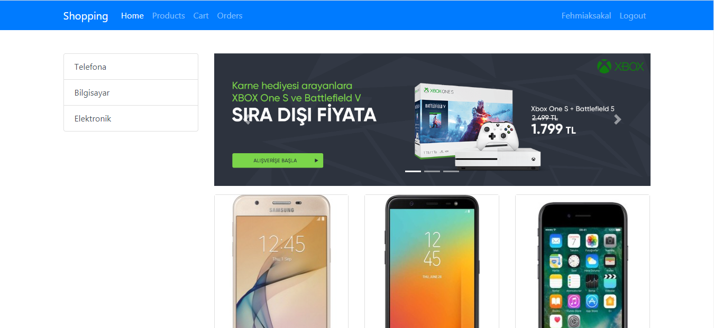
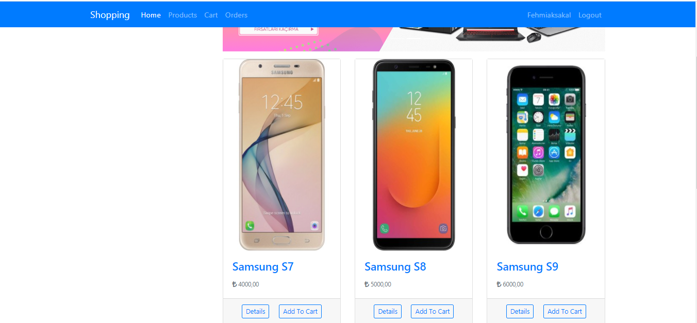
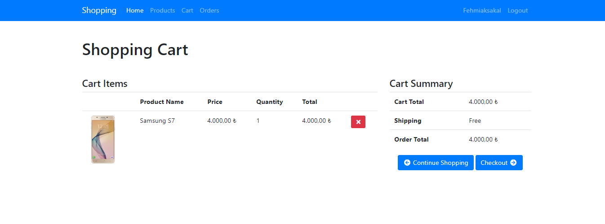
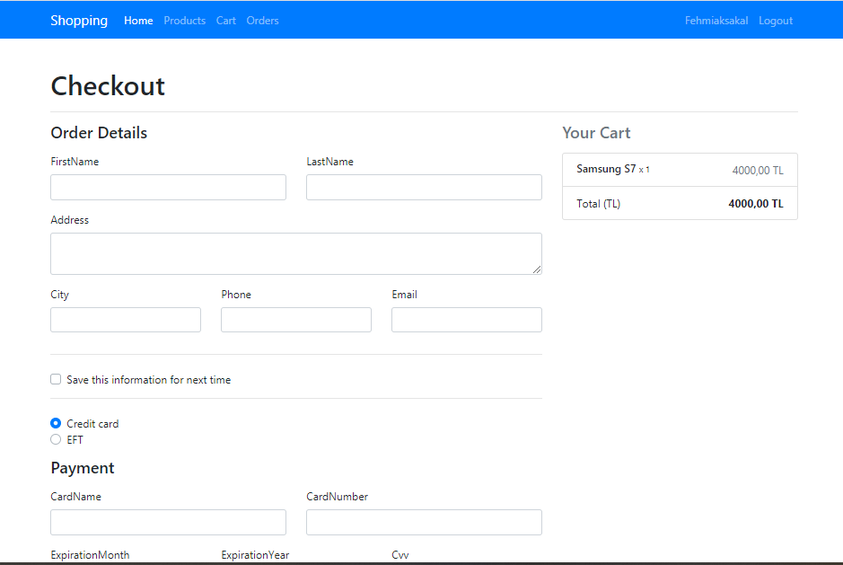
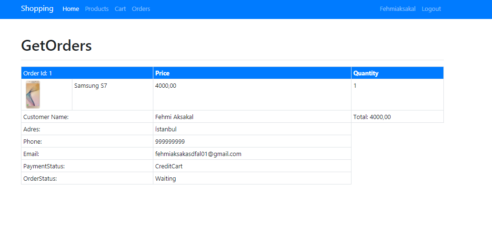

# ShopApp DEMO E-commerce Project

* This project created with ASP.NET Core and have sample E-commerce life cycle. 

* This project for ASP.NET Core beginners.

* Has the following features; 

    * ASP.NET Core
    *  Entity Framework Core
    *  Repository Pattern
    *  Dependency Injection
    *  N-tiers
    *  Client Validation
    *  ASP.NET Core Identity
    *  Tag Helpers
    *  View Components

* Some SS from project;

* Product list,

* Cart,

* Checkout,

* Order List,

